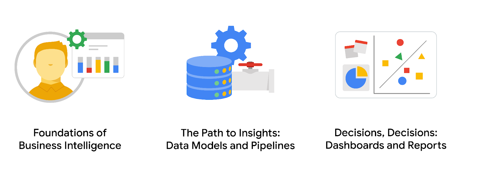

## Business Intelligence Project

### Overview
This repository contains projects and resources from the Foundations of Business Intelligence courses. These courses, part of the Google Business Intelligence Professional Certificate, equip learners with essential skills in data analysis, visualization, and decision-making.

### Course Details

#### Course 1: Foundations of Business Intelligence
- **Key Learnings**:
  - Understand common careers and industries that use BI.
  - Investigate the impact data can have on business decision-making.
  - Explain the important role that BI professionals have in businesses.
  - Develop a BI project plan.

- **Skills Developed**:
  - Business Processes and Requirements
  - Sharing Insights With Stakeholders
  - Stakeholder Management
  - Cross-Functional Team Dynamics
  - Asking Effective Questions

#### Course 2: The Path to Insights: Data Models and Pipelines
- **Key Learnings**:
  - Build data models that answer business questions.
  - Apply the ETL (Extract, Transform, Load) process to workplace scenarios.
  - Explore ETL tools.
  - Construct a pipeline to deliver necessary data.

- **Skills Developed**:
  - Extraction, Transformation and Loading (ETL)
  - Data Transformation
  - Data Management
  - Database Optimization
  - Google Dataflow/Google BigQuery

#### Course 3: Decisions, Decisions: Dashboards and Reports
- **Key Learnings**:
  - Design BI visualizations.
  - Practice using BI reporting and dashboard tools.
  - Create presentations to share key BI insights with stakeholders.
  - Develop professional materials for your job search.

### Project Contributions
This repository includes:
- BI project plans.
- Data models and ETL pipelines.
- Dashboard designs and visualizations.
- Case studies and reports for stakeholder presentations.

### Acknowledgments
This project showcases the skills acquired through the Google Business Intelligence Professional Certificate program, highlighting the importance of BI in today’s data-driven business landscape.

---

Thank you for exploring the Foundations of Business Intelligence project!
